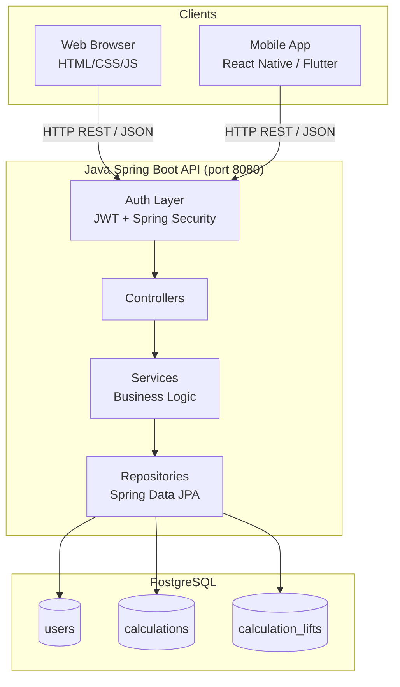
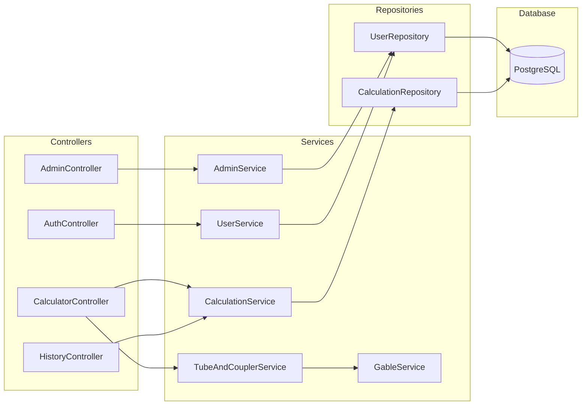
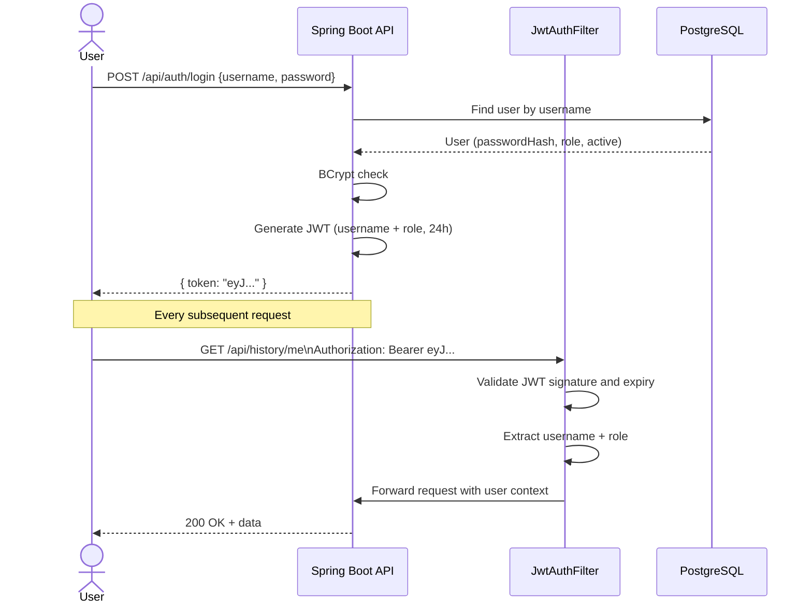
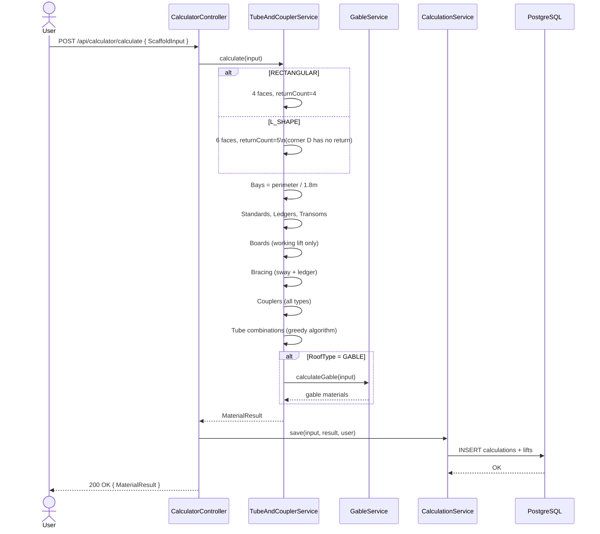
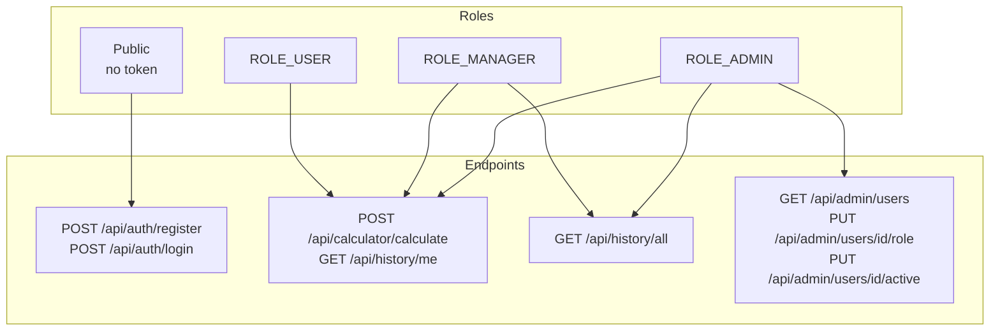
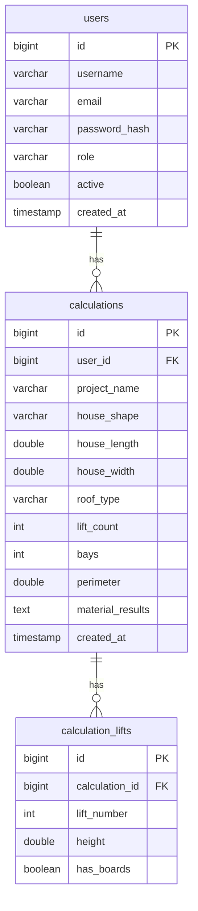

# Scaffold Calculator — Architecture Diagrams

---

## 1. System Overview

---

## 2. Layer Architecture

---

## 3. JWT Authentication Flow

---

## 4. Calculation Flow

---

## 5. Role & Access Control

---

## 6. Database Schema

